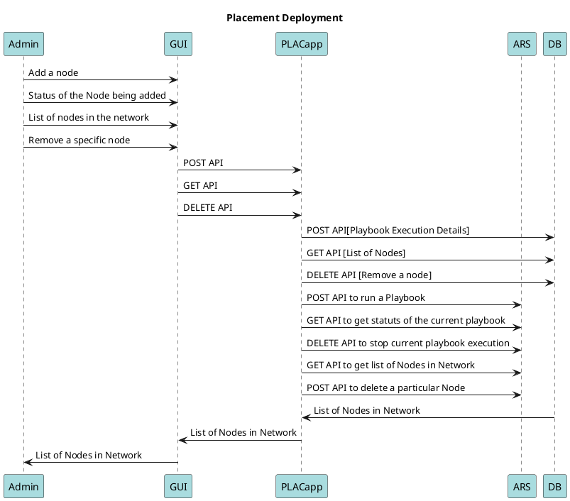

# SpringBootTopicApp

### uml:classdiagram

```plantuml
@startuml
skinparam BoxPadding 50

title "Placement Deployment"


participant Admin #A9DCDF
participant GUI #A9DCDF
participant PLACapp #A9DCDF
participant ARS #A9DCDF
participant DB #A9DCDF


Admin->GUI: Add a node
Admin->GUI: Status of the Node being added
Admin->GUI: List of nodes in the network
Admin->GUI: Remove a specific node

GUI->PLACapp: POST API
GUI->PLACapp: GET API
GUI->PLACapp: DELETE API

PLACapp->DB: POST API[Playbook Execution Details]
PLACapp->DB: GET API [List of Nodes]
PLACapp->DB: DELETE API [Remove a node]


PLACapp->ARS: POST API to run a Playbook
PLACapp->ARS: GET API to get statuts of the current playbook
PLACapp->ARS: DELETE API to stop current playbook execution
PLACapp->ARS: GET API to get list of Nodes in Network
PLACapp->ARS: POST API to delete a particular Node


DB->PLACapp: List of Nodes in Network

PLACapp->GUI: List of Nodes in Network

GUI->Admin: List of Nodes in Network

@enduml
```
